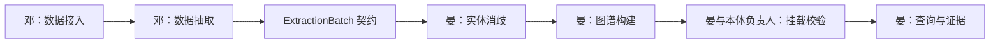

# 工程框架与责任边界

当前交付范围仅为工程结构、模块接口和运行环境。本文中的业务链路用于说明后续实现位置，尚未执行。

## 模块结构

```text
src/bank_project/
├── api/                 # HTTP 路由、参数绑定、占位接口
├── contracts/           # 共享 DTO 草案及错误类型
├── ports.py             # 模块和存储接口
├── application.py       # API 所依赖的接口集合
├── bootstrap.py         # 统一装配点
├── ingestion/           # 邓：数据导入，待实现
├── extraction/          # 邓：对象、事件、关系抽取，待实现
├── resolution/          # 晏：实体消歧，待实现
├── graph/               # 晏：图谱构建，待实现
├── semantics/           # 晏对接本体负责人：挂载与校验，待实现
├── query/               # 晏：查询及证据返回，待实现
├── review/              # 晏修正、邓抽检复测，预留
├── pipeline/            # 共享编排入口，待实现
└── adapters/
    ├── graph_store/     # 仅 Neo4j 连接生命周期
    ├── raw_store/       # 原始数据存储，预留
    └── model_client/    # 模型 SDK，预留
```

## 解耦原则

- contracts 不依赖任何业务模块；ports 只引用 contracts。
- 业务模块只依赖自身、contracts、ports，不直接调用其他业务模块或外部 SDK。
- pipeline 将来通过 ports 编排步骤，当前不执行任何步骤。
- API 只调用 ApplicationServices 中的接口，不直接读写数据库。
- bootstrap 统一选择实现。Neo4j 和模型 SDK 放在 adapters，配置由入口注入。

上述依赖方向由 tests/test_boundaries.py 检查。

## 后续交接方向（未实现）



模块之间传递类型化数据。ExtractionBatch 保留来源、证据、实体、事件和关系候选；不预设客户、转账等具体 schema。步骤顺序、同步或异步执行、持久化事务和重试策略留待业务开发确定。

## 后续实现必须考虑的语义边界

路径不能自动作为直接交易事实；名称相同不能自动代表同一实体；推理结论应与来源事实区分。正式 BFO、BO 内容和挂载方式由相关负责人提供。

这些是设计约束，目前没有对应算法或规则引擎。问答、MAP、报告生成也未在此工程中实现。
