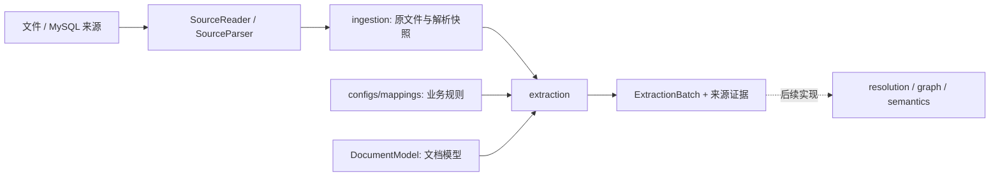

# 模块边界

前两步已实现；业务来源和配置可替换。后续消歧、建图、推理、查询保持独立。

```text
src/bank_project/
├── api/                 # HTTP、上传参数、鉴权、体积限制
├── contracts/           # 交接模型、映射配置类型、引用完整性校验
├── ports.py             # 来源、解析、存储、模型、业务服务接口
├── application.py       # API 所依赖的接口集合
├── bootstrap.py         # 唯一依赖装配点
├── ingestion/           # 通用导入服务，不识别具体业务表
├── extraction/          # 通用表格映射与文档抽取
│   ├── service.py       # 状态、幂等、整体结果发布
│   ├── structured.py    # 选择配置、组合行结果
│   ├── mapping_rows.py  # 一行数据 → 对象、事件、关系
│   ├── documents.py     # 切块、候选与原文证据绑定
│   └── validation.py    # 日期、精确十进制、字段规则
├── resolution/          # 消歧，待实现
├── graph/               # 建图，待实现
├── semantics/           # 语义挂载与校验，待实现
├── query/               # 图谱查询，待实现
├── review/              # 复核，预留
├── pipeline/            # 后续完整流水线，预留
└── adapters/
    ├── sources/         # 受限文件目录、MySQL 只读来源
    ├── parsing/         # 通用表格与文档格式解析
    ├── raw_store/       # 原文件、清单、结果和状态的本地持久化
    ├── model_client/    # 可配置模型 HTTP 接口
    ├── mappings.py     # 读取业务映射配置
    └── graph_store/     # Neo4j 连接生命周期
```



导入不依赖转换，转换不读取原始来源数据库。两步通过持久化的 StoredImport 交接，可以分别调用和重试。
表格通过配置生成对象、事件和关系；没有配置时保留通用记录。客户标签、旅程的字段名和事件码只在配置中，不写进通用流程。

业务模块只依赖自身、contracts、ports 和标准库，不导入 FastAPI、数据库驱动或模型 SDK。API 不导入业务实现；适配器不导入业务模块。tests/test_boundaries.py 自动检查。

一个新业务一般新增映射 JSON；新文件格式新增 SourceParser 实现；新来源新增 SourceReader；复杂转换可替换 Extractor。所有替换在 bootstrap 装配，不修改相邻层的服务逻辑。

FileStore 使用原子替换与每批次文件锁；它是单节点持久化方案。多副本部署应替换共享状态与锁的实现，详细限制见 preparation.md。

模型抽取和确定性映射均输出候选数据。相同名称不自动合并，多个事件不合并成一条概括关系，图中路径不自动推成直接交易事实。BFO、MAP、报告等后续功能未实现。
