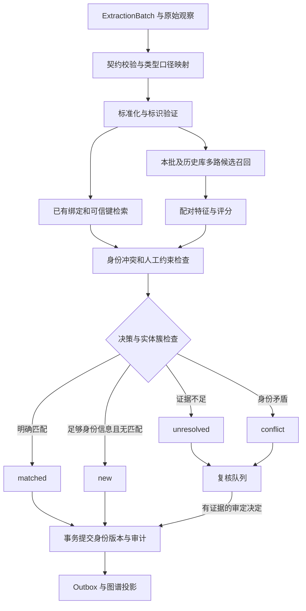

# 实体消歧工程设计与开发方案

版本：设计草案 v1；日期：2026-09-18。适用项目：`bank_project`。

本文是后续开发规格，不代表功能已上线。当前导入和抽取已实现，`resolution`、图谱业务写入及复核仍待实现。算法、接口、表结构和命令中标为“拟新增”的内容，都需要开发和验证后才能使用。准确率目标是验收建议，不是现有系统的实测结果。

配套文档：[正确率评测与验收方案](entity-resolution-evaluation.md)。建议先读本文第 1—4 节确定身份口径，再按第 19 节实施，并从第一阶段就建立评测集。

## 1. 推荐方案与交付目标

采用“明确身份口径 + 可追溯标准化 + 可信标识匹配 + 多路候选检索 + 可校准匹配模型 + 带约束的实体聚合 + 不确定时复核”的组合方案。

第一阶段只开放经过数据验证的确定性自动关联；模糊匹配先推荐候选、影子运行。达到独立测试集和线上抽检门槛后，逐类开放模型自动关联。这允许先交付可用系统，同时避免把一个未验证的相似度阈值投入生产。

可用的消歧系统必须能回答六个问题：

1. 这条记录关联到了谁，还是暂时无法判断？
2. 根据哪些原始证据、哪条规则或哪个模型版本作出判断？
3. 有哪些相反证据和其他候选，为什么没有选择它们？
4. 下一批、重复运行和并发导入时，身份是否保持一致？
5. 判断错误时，能否撤销并修复受影响的事件、关系和查询结果？
6. 在指定数据范围内，错误率、召回率和自动处理覆盖率分别是多少，证据是否充分？

“高准确率”至少同时报告自动关联精确率、端到端召回率、聚类质量和自动处理覆盖率。把所有记录都判为独立实体会得到很高的负例准确率，却几乎没有完成消歧工作。

## 2. 当前工程实际情况与改造边界

| 当前能力 | 代码或配置 | 对设计的影响 |
| --- | --- | --- |
| 表格映射产生实体、事件、关系和证据 | `extraction/mapping_rows.py` | 消歧接收 `ExtractionBatch`，不重新读取银行源库 |
| `identity_scope=key` 按明确键复用候选 | `extraction/structured.py` | 一部分重复已在上游合并，评测不能只看下游候选 |
| 两套银行映射都使用 `customer/customer_id` | `configs/mappings/customer-tags.json`、`customer-journey.json` | 同数据集、同来源系统、同客户号的候选 ID 已相同 |
| 候选 ID 对整个 `keys` 字典计算摘要 | `extraction/mapping_rows.py`、`identity.py` | 添加 ECIF 等键会改变 ID；不能直接把所有别名塞进现有 `keys` |
| 同次结构化抽取中，相同候选的属性冲突会阻止抽取成功 | `extraction/structured.py` | 目前没有跨批冲突检测；时间变化属性需通过新观察模型承载，不能简单放宽为后值覆盖 |
| 文档实体按块与局部 ID 生成候选，没有外部键 | `extraction/documents.py` | 跨块重复、类型映射、字段级证据验证都需要补齐 |
| 文档引用验证检查名称与引文，但不证明所有属性真实 | `contracts/document.py` | 模型生成的证件号不能直接进入可信身份索引 |
| `ResolutionResult` 只有映射与版本 | `contracts/models.py` | 不足以表达冲突、拒判、证据、运行版本和撤销 |
| MySQL 已用于合成来源表；来源适配器只读 | `docs/database.md`、`adapters/sources/` | 消歧状态应使用独立表和写入连接，不修改来源表 |
| Neo4j 当前只管理连接 | `adapters/graph_store/` | 身份主存储与图谱投影需要分别实现 |

源代码位置均相对 `src/bank_project/`，另行写明的仓库路径除外。现有模块边界测试要求业务层只依赖自身、标准库、`contracts` 和 `ports`；数据库、第三方相似度库和模型 SDK 必须放在 `adapters`。

### 2.1 两个必须先处理的上游问题

**稳定键与补充身份声明分开。** 保持现有 `identity_scope=key` 的稳定键规则，另增可选 `identifier_assertions` 配置。稳定键决定来源对象身份，补充声明用于匹配。ECIF、信用代码缺失不应让整行抽取失败，也不应使同一个来源对象因为增加一个属性而更换 ID。

**保留可拆分的观察。** 现有候选可能汇总多个来源证据，一个 `candidate_id → canonical_id` 映射不能把其中错误合并的两个主体拆开。新抽取契约需提供按实体出现位置保留的 `EntityObservation`，定位由来源版本、行/文本位置、出现序号或稳定映射 alias、抽取契约版本组成；角色是属性，同记录同角色也可能有多个主体。候选汇总只是派生视图。过渡期发现旧候选内部身份冲突时，隔离该候选并从原文件按记录重新抽取，不强行塞进一个统一 ID。

文档还需记录明确的提及位置和字段证据位置；不能只依靠相同 quote 文本及首次出现的位置区分多个同名对象。

## 3. 首先确定“同一个实体”的业务定义

### 3.1 推荐身份层级

| 对象 | 身份含义 | 应关联但不应合并的对象 |
| --- | --- | --- |
| `party.organization` | 一个组织或法律主体，具体分支口径需确认 | 集团与子公司、母公司与独立法人子公司 |
| `party.person` | 一个自然人 | 任职公司、共同地址的其他人员 |
| `customer_record` | 某发号主档域中的客户档案；其在 CRM/报表中的复制仍可为同一档案 | 同一主体另外建立的独立客户档案 |
| `account` | 某开户机构及编号域中的账户 | 账户所有者、同一客户的其他账户 |
| `event` | 一次有独立来源身份的业务事件 | 同一客户发生的其他事件 |
| `role` / 关系 | 法人、实控人、客户、经办人等角色 | 角色承载者本身不是新增的另一种自然人 |

同一个人可以既是法人又是实控人；应得到一个人员节点和两种关系。同一企业可以有多个银行客户档案、多个账户，三者不能混为一个身份层级。

现有 `entity_type=customer` 没有区分客户档案与法律主体。**第一阶段保留其现有语义，仅在已确认客户编号域内归一。** 未确认“一客户号是否唯一对应一个法律主体、一个主体能否有多个客户号”前，不因信用代码相同就合并不同 `customer` 档案。后续可显式建 `customer_record → represents → party`，再对 party 做跨系统消歧。

文档中的 `company`、`organization`、`企业` 等类型需要受控类型映射；不能让模型自由字符串直接决定匹配范围。`customer` 也不能无条件映射成组织，因为实际客户可能是自然人。

### 3.2 待业务确认项与未确认时的默认策略

| 需确认内容 | 未确认时默认行为 |
| --- | --- |
| 客户号由谁发放、在哪个机构/租户/系统范围唯一 | 仅在明确来源域内使用，跨域同值不关联 |
| 客户号、ECIF 是否会复用、注销后是否重发 | 不能假定永久唯一；保留有效期，疑似复用进入冲突 |
| 多个客户号是否可属于同一法律主体 | 保留独立档案，可建立待核实的主体关联 |
| 法人/实控人编号是否与其他人员客户号同域 | 独立命名空间，确认映射后再关联 |
| 信用代码与机构分支、历史变更的适用范围 | 只作为带来源的身份声明；不预设所有组织都适用 |
| 来源修订、撤销、历史快照的时间含义 | 原始观察不可覆盖；区分观察时间与事实有效时间 |
| 数据集能否跨域关联 | 默认隔离；跨域规则必须显式登记 |
| 自动决策可接受的误合成本和复核能力 | 第一阶段只开确定规则；其余保留候选并复核 |

这些确认项不会阻止开发通用框架，但会决定哪些规则可以开启自动合并。

## 4. 身份信息、标准化与数据质量

### 4.1 标识不是单独一个字符串

建议内部身份键表达为：

```text
IdentityKey = (
  tenant_or_access_domain,
  dataset_identity_namespace,
  entity_granularity,
  issuer_namespace,
  key_type,
  normalized_value
)
```

`source_system` 表示证据来自哪里，`issuer_namespace` 表示编号由谁定义；两者不能混用。两个来源若都使用同一银行客户主档编号，可通过配置映射到同一发号域；这不意味着删除原始来源信息。`dataset_id` 是逻辑隔离标识，不能替代鉴权。

发号域、来源可信等级、允许使用的身份声明必须由服务端登记的连接、映射配置和权限赋予。现有导入请求中的 `source_system` 是自由文本声明；上传者写入 `bank` 不能因此取得可信主数据身份或自动关联权限。

每个标识声明还应保存原值、原始字段/原文 span、证据引用、有效起止时间、观察时间、验证状态、可信来源等级、标准化版本。多个重复转载来源不算多个独立身份依据。

### 4.2 当前字段的推荐用法

| 字段 | 用途 | 使用条件与边界 |
| --- | --- | --- |
| `cust_ind` / `CUST_ID` | 当前两表客户档案的精确关联 | mock 明确同域；正式来源另行确认 |
| `ecif_cust_id` | 可能的主数据关联键 | 确认发号域、对象粒度、唯一性与历史复用规则 |
| `unify_credit_code` | 组织身份的重要声明 | 格式与来源有效性检查；mock 占位值不能验证正式规则 |
| `legal_rep_cust_id` / `act_ctrl_psn_cust_id` | 人员身份声明 | 先确认两个字段是否同域；当前默认映射尚未独立抽取人员 |
| `cust_nm` / `legal_rep_nm` | 名称比较与候选检索 | 同名不能单独合并；公司名与人员名不同模型处理 |
| `busin_addr`、行政区划、成立日期 | 辅助比较 | 地址共享、迁址、日期错误均可能出现 |
| `account_number` | 账户身份 | 发号机构/产品域/有效期决定唯一范围；不能拿账号直接代表客户 |
| `DT + ROWKEY` | 旅程来源记录/事件身份 | 不用来匹配客户，也不因客户相同去重事件 |

### 4.3 标准化规则

标准化只产生比较视图，永远保留原始值和转换步骤。规则需按字段、编号域版本化。

| 类型 | 推荐处理 | 不能默认执行的操作 |
| --- | --- | --- |
| 标识符 | 文本存储；按域规则处理首尾空格、合法字符与大小写 | 转整数、删除前导零、对任意编号执行统一大小写或全局 NFKC |
| 企业名称 | 同时保留原名、规范空白标点版、历史名称、检索用简化版 | 删除“分公司”等身份区别后直接精确合并 |
| 人名 | 保留原名与受控别名；多种转写只用于召回或特征 | 拼音同音直接判同人 |
| 地址 | 保留原文及可解释的省市区/街道等分量 | 地址相同等于主体相同 |
| 日期 | 保留实际精度；区分成立日期、快照日期、事件日期 | 缺日期补当天、缺月日补一月一日作为精确证据 |
| 缺失 | 区分未提供、无效、明确未知与真实值 | 将两个空值、`unknown`、全零占位符当匹配 |

身份证件、信用代码等格式校验器单独开发并按权威字段规范测试。校验通过只说明格式合理，不证明真实存在或属于当前记录。OCR 的 `0/O`、`1/I` 修复只生成候选，不能静默改写强标识。

### 4.4 每个来源上线前的数据画像

至少统计：字段缺失率、无效率、键重复率、同键互斥声明、名称/地址频率、源间已确认键重叠率、时间覆盖、类型分布和每个客户档案事件数。“同主体多键”和真实主体重叠率需要已确认主档对应表或人工金标；未核实部分只报告疑似关联。输出 `profiling_report.json` 与异常样本清单；样本只保存到受控数据目录。

即便来源声明客户号唯一，也要检测“同键同时出现互斥身份声明”。来源可信度是规则配置和可验证证据，不能用一个随意赋值的分数掩盖来源缺陷。

## 5. 端到端处理流程



必须同时比较“本批记录与历史实体”和“本批记录相互之间”。只查历史数据库会让第一批数据中同一主体的两条记录分别创建两个新实体。

先为整个批次或冲突连通组收集证据、建立暂存键索引、检测冲突，再决定归属；不能逐行遇到一个相同键就立刻写入。后到的一条矛盾记录不应被早先的不可逆合并掩盖。

## 6. 确定性关联：先实现、先评测

只有满足下列条件，身份键相等才可自动关联：

1. 类型和身份粒度兼容，命名空间匹配。
2. 标识不是空值/占位符，满足该来源的格式和可信度要求。
3. 键的唯一性、有效期和复用政策允许此次关联。
4. 全部相关身份声明没有未解决的冲突。
5. 没有有效的人工禁止关联约束。
6. 目标实体簇内部仍满足身份约束。

规则输出 `rule_id` 和证据，不输出伪造的“概率 1.0”。“按同域客户号匹配”是决策方法，可靠性由独立抽检衡量。

| 场景 | 决策 |
| --- | --- |
| 同域客户号相同、来源合格、无冲突 | `matched`，或首次创建后把本批同键观察关联到同一 `new` 实体 |
| 同域客户号相同，但同时出现互斥的已验证主体标识 | `conflict`，冻结该键的自动关联能力 |
| 两个有效标识分别指向两个已有实体 | `conflict`，不能任选一个，也不能直接把两个实体合并 |
| 没有可用键，但名称完全相同 | 进入候选检索；不能直接自动关联 |
| 两个不同客户号拥有相同信用代码 | 由身份粒度规则决定：可能是两份档案代表同一主体，不能默认档案相同 |
| 共享电话、地址、法人、集团或交易对手 | 只作辅助特征或关系信息 |

只有“在同一发号域和有效时间内定义为互斥”的不同强标识，才构成硬冲突。不同来源客户号、历史换证、同主体多账户等差异不能一概作负例。

## 7. 模糊匹配：候选召回、评分与校准

### 7.1 多路候选召回

按已确认的实体类型和身份域检索，再对各路候选取并集、去重并保留召回原因：

- 精确标识：已验证键、历史合法别名、已确认的跨系统对应表。
- 名称：规范化全名、历史名称、字符 n-gram 倒排；常见名称需与其他信息组合。
- 组合：名称部分匹配 + 行政区、名称 + 成立日期，按可用字段选择。
- 地址等辅助字段：与名称或其他独立信息联合检索。
- 文档语境/向量：后续在有标注验证时加入，用于找候选。

召回范围包含正式实体、暂存观察及本批尚未提交的对象。不能仅因实体当前展示名已改变而丢失历史名称索引。

候选召回决定匹配器的上限；真正对象未进入候选集，再好的评分器也无法找回它。多路较严格规则通常比一条极宽规则更便于控制计算量，需分别验证召回与比较数。[Splink 官方 blocking 文档](https://moj-analytical-services.github.io/splink/topic_guides/blocking/blocking_rules.html)

拟配置 `max_candidates`、每路上限、热点 block 大小与超时。触发上限时设置 `retrieval_complete=false`，报告被截断的规则与数量，转入复核或专门的宽检索任务；不能悄悄取 Top-K 后声称“未找到，所以是新实体”。近似向量检索本身也需要召回评测，`retrieval_complete` 只表示预定检索流程完成，不代表数学上穷尽所有真实匹配。

### 7.2 配对特征

| 特征组 | 例子 | 主要注意点 |
| --- | --- | --- |
| 标识比较 | 同域相等、不同、缺失、格式异常、有效期重叠 | 硬冲突独立于模型执行 |
| 名称 | 精确相等、字符距离、n-gram 相似度、别名命中 | 三种名称距离不是三份独立证据 |
| 地址与地区 | 行政区一致、街道相似、迁址历史 | 共享地址很常见 |
| 时间属性 | 成立日期一致、差异幅度、事实有效期 | 缺失和冲突分别编码 |
| 人员辅助属性 | 经确认的证件、出生信息等 | 当前数据缺少时不虚构特征 |
| 来源质量 | 字段验证状态、原始来源、抽取方式 | 来源重复转载需去相关 |
| 频率与歧义 | 名称在库中出现频次、候选数量 | 常见名字匹配的区分力更弱 |
| 关系语境 | 经独立证据确认的任职或其他关联 | 禁止使用此次模型自己推断的关系反过来证明自己 |

### 7.3 模型选型与概率含义

推荐顺序：确定规则基线 → 可解释配对模型 → 必要时增加更复杂模型。第一版模糊模型可使用有正则化的逻辑回归；只在标注和误差分析支持时再比较树模型。批量离线场景可将 Splink/Fellegi–Sunter 作为另一个可比较的基线，无需同时引入多个框架。

Fellegi–Sunter 的基本形式是按比较结果累计对数似然比。令 `M` 表示同一实体、`U` 表示不同实体、`γk` 表示第 k 组比较结果，则在模型假设下：

```text
score = log(prior / (1 - prior))
        + Σk log(P(γk | M) / P(γk | U))
```

它解释了为什么少见名称的一致通常比常见名称的一致更有区分力；但条件独立假设、先验和来源分布会影响可靠性。相关特征不能简单重复相加。参考 [Splink 的 Fellegi–Sunter 模型说明](https://moj-analytical-services.github.io/splink/topic_guides/theory/fellegi_sunter.html)。

任何模型的原始分数、字符串相似度、向量余弦值都不能直接称为“正确概率”。在与训练实体隔离的校准集上检验并校准概率；画可靠性曲线，检查高分区的样本量和实际误合率。正负样本重采样会改变先验，校准集应反映实际候选分布或使用明确的抽样权重。校准方法及独立数据要求见 [scikit-learn 官方说明](https://scikit-learn.org/stable/modules/calibration.html)。

还要单独评估“从多个候选选择最高分”后的最终决策：配对概率的校准不自动保证 Top-1 决策或实体簇的错误率。竞争候选先按目标 canonical 去重，同一实体的两条历史观察不能被误当成两个竞争实体。阈值、候选间分差和实体簇校验均在开发集选择，最终在冻结测试集验证。

### 7.4 模糊匹配的开放条件

同时满足以下条件才开放自动匹配：无硬冲突、候选检索流程完成、来源/类型属于已验证适用范围、身份依据足够、最高候选超过该场景阈值、没有难以区分的竞争候选、实体簇约束检查通过。

阈值不是统一拍定的 `0.9` 或 `0.95`。根据验证集选择满足精确率置信下界的最高覆盖率方案；样本不足的类型继续复核。低分只能说明“暂未找到可信关联”，不证明一定是新主体。

## 8. 从配对判断到实体簇：防止传递性错合

真实的“同一实体”关系具有传递性，模型产生的“高相似度”关系不具备这种保证。

```text
A：可信主体标识 X，名称“某某科技”
B：只有名称“某某科技”，身份信息不足
C：可信主体标识 Y，名称“某某科技”

A—B 高分，B—C 高分；如果 X、Y 在该口径下互斥，不能合并 A、B、C。
```

第一阶段允许经冲突检查的可信键形成实体，不根据模糊边的连通分量整体归并。后续采用保守的锚点式归属：待匹配观察优先连接到有可靠身份依据的实体；弱记录不得充当桥梁，把两个独立的既有实体自动粘合。

拟将观察 `o` 加入实体 `E` 时，至少执行：

1. 检查 E 中全部有效身份声明是否与 o 兼容；检查键唯一范围、有效期、类型和人工 cannot-link。
2. 比较 o 与 E 的可靠身份锚点和相关原始观察，避免仅与“属性融合后虚构的代表记录”比较。
3. 检查候选竞争性：o 是否也能高分匹配另一个实体。无法区分时拒判。
4. 检查簇增长异常、连接仅依赖单条弱证据、合并后身份组合冲突等风险。
5. 记录用于此次归属的具体支持边，而非仅记录一个簇 ID。

两个已有实体的合并应走独立 `MergePlan`：汇总两边全部身份约束、来源证据、成员数和受影响事件，验证后提交。初期这类操作统一人工复核。对于没有可靠锚点的小簇，可比较全体跨簇成员；大簇若无法在预算内完成必要验证，继续保留候选，不通过降低检查标准来自动合并。

“跨簇最小分数达标”可以作为保守规则，但仍需端到端验证；最小值、平均值、分数乘积都不是天然正确的簇概率。人工 must-link 也必须具有来源与审定依据，不能无视新的硬冲突。

## 9. 决策状态、拒判与输出契约

### 9.1 状态定义

| 状态 | 含义 | `canonical_id` | 下游处理 |
| --- | --- | --- | --- |
| `matched` | 与已有或本次计划中的实体建立可接受归属 | 必填 | 可进入身份已确认的投影 |
| `new` | 身份信息达到该类型创建标准，预定检索已完成且无可信已有匹配 | 必填 | 新注册实体；不宣称穷尽世界上所有同主体记录 |
| `unresolved` | 信息不足、竞争候选接近、超时/截断或适用范围未验证 | 空 | 暂存观察，进入补充证据/复核队列 |
| `conflict` | 有互斥身份声明、多个键绑定冲突或人工约束冲突 | 空 | 隔离，阻止相关自动关联并复核 |

`method` 与状态分开，取 `exact`、`model`、`human` 或无匹配方法。`new` 不能用来掩盖未能处理的弱记录；只有一个模糊名称的文档实体默认 `unresolved`。需要展示时可给它独立的 `provisional_id`，该 ID 仅代表待定观察，不计入已确认实体，不得成为自动合并的可信身份锚点。

这里的“身份已确认”仅表示消歧门槛已通过；文档抽取的事件、关系、属性仍可能需要业务语义复核。不能因身份匹配成功就删除原有 `review_required`。

### 9.2 已有归属的重评状态转移

最新一次评估结果与当前生效归属分开保存。增加 `assignment_action=keep|assign|retract|quarantine`，禁止用新决定覆盖旧行来隐式改变身份。

| 原状态与新情况 | 归属动作 | 查询与投影行为 |
| --- | --- | --- |
| 无旧归属，当前 matched/new | `assign` | 建立归属，发布投影 |
| 无旧归属，当前 unresolved/conflict | `keep` | 保持无正式归属；记录待定/冲突 |
| 有旧的有效归属，本次因超时或信息不足未完成重评 | `keep` | 保留旧决定，显式标记本次未重新核验，不把故障解释为身份反证 |
| 新的可信身份矛盾影响旧归属 | `quarantine` | 隔离受影响的归属/键，禁止当自动锚点；同步撤下或标记争议投影 |
| 经审定的纠正、拆分或迁移 | `retract` 后 `assign`，或仅撤销 | 关闭旧归属并发布补偿更新，保留历史 |

隔离不删除原事实；要记录受影响范围和待审原因。新冲突只与某个来源声明相关时，不能不加分析地隔离整个客户群。已批准纠错才进行正式迁移，临时技术故障不触发不可逆身份变化。

迁移时一条最终决定可使用 `assignment_action=assign`，其 `assignment_changes` 明确包含“关闭旧归属”和“建立新归属”两项，并在同一登记库事务提交；不要求为同一观察制造两个互相矛盾的最终状态。

### 9.3 拟新增契约

建议增加 `contracts/resolution.py`，通过独立版本迁移，保留历史批次可读。以下是字段规格，非当前可调用接口：

```text
ResolutionContext
  dataset_id, identity_namespace
  run_id, input_digest, idempotency_key
  policy_version, normalizer_version, model_version|null
  calibration_version|null, threshold_version
  registry_read_version, mode = shadow|commit

ResolutionDecision
  decision_id, observation_id, candidate_id
  status = matched|new|unresolved|conflict
  canonical_id|null, provisional_id|null
  decision_origin = automatic|human
  method = exact|model|human|null
  assignment_action = keep|assign|retract|quarantine
  reason_codes[], evidence_refs[], supporting_decision_ids[]
  rule_id|null, raw_score|null, calibrated_probability|null
  candidate_options[]   # 含候选实体版本、分值、召回原因和冲突
  retrieval_complete, constraint_check_result
  decided_at, actor, supersedes_decision_id|null

ResolutionResultV2
  result_schema_version, run_id, input_digest
  registry_read_version, registry_commit_version|null
  policy_version, normalizer_version, model_version|null
  calibration_version|null, threshold_version
  decisions[], review_case_ids[], counts_by_status
  observation_to_canonical
  candidate_to_canonical   # 仅在每个候选内部归属一致时提供兼容映射
  effective_assignments   # 当前生效归属、决定版本、隔离/重评标志
  assignment_changes[]    # 明确列出本次提交造成的归属变更
  publication_state = shadow|registry_committed|graph_applied
```

每个输入观察都必须有且只有一条本次最终状态。`observation_to_canonical` 只包含 `matched/new`，其余不能填假 ID。当一个旧候选内部包含多个不同真实主体时，不提供有歧义的兼容映射；返回需按观察重建的明确结果，旧 GraphBuilder 不得继续处理。

本次评估映射不等同于登记库全部当前归属：`unresolved + keep` 可以保留先前已核实归属，但不能算本次自动匹配成功。图谱根据 `assignment_changes` 和对应版本的有效归属更新，不因映射中缺少一项就擅自删除历史正确关联。`method` 在 matched 时必须有值；是否自动处理以 `decision_origin` 为准，避免把人工建新混入自动覆盖率。

升级后的事件参与方、关系端点应能引用原始 `observation_id`/mention ID，再经版本化归属投影为 canonical ID。否则仅有已合并的旧 `candidate_id`，分裂时无法确定一条关系实际属于哪一边。

引用完整性检查需扩展到决策证据、候选目标版本、审核记录和结果计数，防止丢实体被当成成功。

## 10. 存储设计：身份登记库作为事实依据

### 10.1 推荐第一版技术组合

沿用 Python/FastAPI。采用独立 MySQL 消歧状态库或独立 schema 保存身份、决策、事务和审计，Neo4j 作为可重建的关系查询投影。二者职责分开：先将身份决策可靠提交，再异步投影到图谱。

本地可以使用相同 MySQL 实例降低开发成本，但必须使用独立迁移和写入账号；来源读取继续使用只读账号。当前 `database/mysql/schema.sql` 负责合成来源表，不应混入消歧状态 DDL。

模糊检索初期采用可解释的名称倒排/分桶索引和批量查询，只有基准证明需要时再接独立搜索或向量服务。机器学习实现通过 `PairScorer` 适配器替换，不改变决策、审计和存储模型。

### 10.2 逻辑表设计

以下为拟新增模型，SQL 类型、索引长度、迁移方案需在实现时确定。

| 表 | 关键字段/约束 | 职责 |
| --- | --- | --- |
| `er_registry_version` | 隔离域主键、当前版本 | 提交互斥与版本检查 |
| `er_run` | run ID、输入摘要、幂等键、所有版本、状态、计数 | 运行与重放依据 |
| `er_observation` | observation ID、来源对象、批次、候选、证据、payload 摘要、有效时间 | 不可变的来源观察 |
| `er_entity` | canonical ID、粒度、状态、创建时间、版本 | 稳定实体身份 |
| `er_identifier_claim` | 观察、发号域、键类型、原值/规范值引用、验证状态、有效期、supersedes/撤销引用 | 所有标识声明，包括有冲突或被纠正的声明 |
| `er_identifier_binding` | 当前可用身份键、canonical ID、证据/决定、版本 | 仅存已验证且可安全查找的键归属 |
| `er_membership` | 观察、canonical ID、决定、起止注册版本、有效/隔离状态 | 历史与当前归属，不直接覆盖旧归属 |
| `er_attribute_fact` | 观察、属性、值、事实有效时间、来源时间、证据 | 可追溯、可时态查询的属性事实 |
| `er_decision` | 输入、动作、方法、原因、分数、证据、版本、取代关系 | 不可变决策日志 |
| `er_constraint` | must-link/cannot-link、适用对象、有效域、审核证据 | 人工与业务约束 |
| `er_review_case` | 问题、候选、风险、状态、指派、审定版本 | 复核生命周期 |
| `er_entity_change` | merge/split、前后成员、影响范围、原因、版本 | 修正与身份沿革 |
| `er_outbox` | 唯一变更 ID、目标版本、负载、投影状态、重试信息 | 图谱和索引的可靠更新 |

首期可将配对分数、候选理由保存到 `er_decision` 的结构化负载，数据量增长后再拆分 `er_pair_score`。来源原文保留在已有原文件/证据存储，身份库保存受控引用，避免复制整份敏感文件进日志。

### 10.3 重要唯一性与历史约束

- 观察的来源键包含隔离域、输入批次/快照、来源位置、实体出现位置/序号或稳定映射 alias、契约版本；角色不单独承担唯一性。同一 `candidate_id` 跨快照可以有多个不同观察。
- 幂等键绑定请求内容摘要；相同键不同内容返回冲突，不静默复用。
- 每个观察在同一身份注册版本最多一个生效归属；`unresolved/conflict` 可没有正式归属。
- 经确认“永久唯一且不复用”的键可具有当前绑定唯一约束；不能把电话、地址等非唯一线索放进同一唯一索引。
- 可复用标识必须带有效期；普通唯一索引不足以表达区间不重叠，需在事务和锁内验证区间，未知时间不能强行绑定。
- 唯一绑定发生冲突时，保留全部 claims，停止该键的自动决策；不能用 upsert 把旧拥有者覆盖为新拥有者。
- 标识查询用明确区分规则的 collation/二进制规范键，应用与数据库的相等语义必须一致。

声明不可变不意味着永远有效。来源纠错以 `supersedes_claim_id` 或撤销事件生效，同时保留业务有效时间与登记生效版本；旧错号保留审计，但失去强键绑定和冲突检查资格，不能继续当历史别名自动关联。编号复用使用同键多段有效区间或明确的发放代次，不能仅按观察日期臆造有效期。

当前 canonical ID 建议由登记库分配随机 UUID 并持久化。不要使用公司名或整组当前属性计算永久 ID。重试稳定性由幂等记录和事务保证，而非“每次随机生成恰好相同”。重建整个登记库也应恢复 ID 日志，不能只重新跑一次算法后认为外部引用仍稳定。

## 11. 跨批次、并发和图谱一致性

### 11.1 提交协议

第一版先按身份隔离域串行提交，缩小并发正确性难度；模型计算和大范围检索放在事务外。

1. 创建或读取幂等运行记录，冻结输入、策略、模型及读取到的登记库版本。
2. 读取快照、构建本批暂存索引，生成决策计划；不改正式身份。
3. 开始短事务，锁定隔离域版本行，检查登记库版本是否仍与计划一致。
4. 若版本变化，放弃当前计划并基于新版本重新检查受影响决策，有限重试；不能直接覆盖后来提交的身份。
5. 在同一事务中写实体、有效键绑定、归属、决策、复核问题和 outbox，递增版本并提交。
6. 投影器消费 outbox，按变更 ID 幂等更新检索索引和 Neo4j，完成后记录投影水位。

数据库使用唯一约束作为最终防线；逻辑上的“先查不到，再插入”不足以防止两个并发批次创建重复身份。锁实现和隔离级别需以集成测试验证，可参考 [MySQL InnoDB 锁文档](https://dev.mysql.com/doc/refman/8.4/en/innodb-locking.html)。

**索引水位也属于正确性条件。** 仅检查登记库版本不够：读取库 v10、搜索索引仍为 v9 时，即便提交前库没变化，也可能漏掉 v10 的新实体。强键直接查事务主库；模糊检索返回 `indexed_registry_version`、标准化与索引配置版本。检索应使用对应读取快照的索引，或补查 `(indexed_version, registry_read_version]` 的登记库增量，并在读取快照复核候选。无法补齐、索引超前且不能按快照过滤、索引版本不兼容时，设置检索不完整，禁止依赖该检索自动新建或模糊匹配。

第一版限制单次提交规模并监控锁时间。以后若按键/实体分片锁，必须固定锁顺序、支持死锁重试，并对跨分片合并设计专门事务，不能直接撤掉全域锁。

### 11.2 版本与重试语义

`input_digest` 应覆盖候选、观察、证据引用和抽取配置；运行还记录身份策略、标准化、模型、校准、阈值、代码及登记库读取版本。旧运行读取返回旧结果；需要新规则或新登记库重新判断时创建新运行，并展示差异。

策略升级前进行 shadow 重放，列出新增匹配、失去匹配、实体合并/分裂、受影响事件和冲突变化。新模型不能在读接口中悄悄重新决策。回退模型版本只影响后续判定，已经提交的错误归属还必须通过修正事件撤销。

### 11.3 图谱投影规则

正式投影仅使用有可接受身份归属的观察；待定实体相关的事件/关系仍完整保存在来源事实层，标记待投影，不能无声丢弃。查询结果应能报告暂未纳入的范围。

为每条边、事件参与方保存原始观察引用、决定版本和来源证据。合并客户不会删除同客户的多个事件，也不会把一条多跳路径变成原始直接交易事实。事件去重需要单独的业务事件身份规则。

outbox 按至少一次投递设计，消费者使用唯一变更 ID 去重。首期按隔离域登记版本顺序消费，同一版本的全部图补丁及该域水位在一个 Neo4j 事务中原子提交，并限制单版本规模。大规模重建则写版本化记录或暂存 epoch，完整构建后原子切换可读版本。不能仅返回旧水位，却让查询看到新版本已经局部写入的图。

读接口返回 `registry_version`、`graph_applied_version` 与是否落后；水位只能推进到连续完整应用的版本。删除、撤销带版本与 tombstone，旧消息不得复活已撤销的边。不要承诺跨 MySQL 和 Neo4j 的原生一次性原子事务。影子运行不得发布正式 outbox。

每个源事实/事件参与方保留稳定投影 ID。多条源事实支持同一条展示聚合边时，撤销其中一条只撤销对应支持，重新计算聚合；不能把其他来源仍支持的边一起删掉。重试和端点重写也不能重复累加事件数、金额等属性。

投影故障只影响图谱进度，不应丢失已提交的身份决定。停机恢复应能重放未完成 outbox，并与登记库做周期一致性核对。

## 12. 属性融合、合并、拆分与撤销

### 12.1 身份相同不代表所有属性相同

企业更名、地址迁移、法人变更、余额变化都可能发生在同一主体上。将身份归属与属性选择分开：先保存带来源和时间的属性事实，再按属性特定规则生成当前展示值。

例如余额必须带账期和币种；不同快照的余额不参与身份冲突判定，也不能直接相加。名称保留历史别名；两条同时有效且冲突的登记属性保留争议状态。展示值的选择需要来源优先级、事实时间和明确规则，不能只按最后写入覆盖。

### 12.2 合并计划

`MergePlan` 包括拟保留 ID、被合并 ID、成员与键变化、全部冲突、受影响事件/关系数量、引用此身份的下游对象、证据和审定人。经审定后保留一个 canonical ID，其他 ID 记录重定向与生效版本，历史版本仍可查询。

身份选择规则保持确定，例如优先保留被外部系统引用的既有 ID；不让一次名称更新决定保留哪一个 ID。

### 12.3 拆分计划

`SplitPlan` 必须明确每个原始观察和标识声明进入哪个新实体；关系端点依赖其原始观察重新投影。无法分配的成员回到待定状态，不能凭比例或名称猜测。

一对多拆分不能使用单目标 redirect 表达。旧实体应标记 `split`，记录多个后继和成员分配；无观察上下文的旧 ID 查询必须返回歧义及后继信息。只有证据能明确旧实体主要身份时，才按审批规则选择一支保留旧 ID。

### 12.4 撤销与影响检查

不删除历史决定；用补偿决定使旧归属失效，更新当前键绑定、检索索引、人工约束适用范围及图谱投影。需要检查依赖旧决定的后续自动关联，按依赖链重新评估受影响部分。仅撤销最初一条边而留下传播后的归属，不能算修复完成。

验收至少包含：错误合并 → 后续批次继续关联 → 人工拆分 → 所有受影响观察、键和关系恢复正确 → 历史版本可追溯。

## 13. 人工复核与大模型的角色

复核页面必须并列显示：原始字段/原文、证据位置、规范化视图、候选实体、匹配与反对依据、历史变更、预期影响。不要只展示一个“相似度 98%”按钮。

审核动作包括确认归属、判为不同、要求补充证据、修正字段声明、合并、拆分。记录审定人、理由、证据、时间、输入版本和影响范围；批量高影响合并可配置第二人复核。过期的审核页面提交必须检查目标版本，发生变更则重新审阅。

复核优先级可综合身份硬冲突、影响实体/关系数量、竞争候选接近程度和业务重要性。主动学习可以优先采集边界案例，但主动学习队列不是总体随机样本，不能直接拿它报告生产正确率。

大模型适合提取文档提及、整理别名和辅助解释，不作为强身份键的真实性证明，也不作为评测金标裁判。模型生成的标识需绑定字段级原文证据并验证归属语境；只在原文出现不代表一定属于当前主体。大模型自报置信度不参与自动关联门槛。

实际数据处理沿用受控来源和部署策略。日志记录脱敏身份引用、规则和计数；查看原文与发起合并/拆分需要相应权限。若精确索引使用 HMAC，应保存密钥版本和轮换方案；HMAC 不支持模糊匹配，也不能替代原文访问控制。

## 14. 在当前代码库中的模块拆分

以下目录为建议，不在本次文档工作中创建实现。初期允许合并较小的纯函数文件，但职责和依赖方向保持清楚。

```text
configs/resolution/
  identity-policies.json          # 身份粒度、来源域、键约束、信任条件
  normalization.json             # 按字段/来源版本化的标准化规则
  retrieval.json                 # 候选通道、预算、热点处理
  thresholds.json                # 已验证的分场景阈值及模型版本
  evaluation.json                # 指标、切片与验收门槛

src/bank_project/contracts/
  resolution.py                  # 观察、声明、决定、结果、修正计划
  graph_changes.py               # 可表达归属变更与失效边的投影契约
src/bank_project/resolution/
  service.py                     # 协调流程与幂等运行
  normalization.py               # 纯规则标准化
  identifiers.py                 # 身份键、可信度与时间兼容
  features.py                    # 纯业务特征组装
  decisions.py                   # matched/new/unresolved/conflict 决策
  constraints.py                 # 全簇约束与人工约束
  clustering.py                  # 暂存组和受约束归属计划
  changes.py                     # merge/split 影响计算
src/bank_project/adapters/
  resolution_store/              # MySQL 事务、迁移、索引查询
  resolution_scoring/            # 第三方相似度/机器学习推理与模型加载
  resolution_index/              # 可替换的候选索引
src/bank_project/review/          # 复核状态机，经 ports 调用身份修正能力
src/bank_project/evaluation/     # 标准库可实现的指标、数据校验与回放协调
database/migrations/             # 独立的 er_* 表迁移
tests/resolution/                # 行为、事务、聚类、修正测试
tests/evaluation/                # 独立手算指标与抽样校验
```

业务模块不能直接导入 `scikit-learn`、`Splink`、SQL 驱动或调用其他业务模块的实现。通过 `ports.py` 注入适配器；`bootstrap.py` 装配。若评测置信区间使用 SciPy 等库，也放在适配器或独立开发工具中，不能破坏当前边界测试。

### 14.1 建议新增端口

| 端口 | 最小职责 |
| --- | --- |
| `IdentityRegistry` | 按作用域和版本读取实体、声明、绑定、归属与历史 |
| `CandidateRetriever` | 返回候选、通道、检索状态、索引水位、截断信息 |
| `PairScorer` | 对标准化特征返回分数、可选校准概率、模型版本 |
| `ResolutionStore` | 运行记录、决定、复核问题、历史快照 |
| `ResolutionUnitOfWork` | 持有事务、版本检查、唯一性及 outbox 提交 |
| `ResolutionChangeHandler` | 接收审定 merge/split/纠正计划并重新验证 |
| `ResolutionProjector` | 按版本幂等应用图谱和检索投影 |

标准化、特征组装、冲突检查等没有外部依赖的内部逻辑无需都做 Protocol；只对需要替换或涉及 I/O 的边界抽象。

### 14.2 协调伪代码

```python
# 设计伪代码：辅助类型和存储端口均待实现。
def resolve(batch, context):
    prior = store.find_by_idempotency_key(context.idempotency_key)
    if prior is not None:
        require_same_request_digest(prior, context)
        return prior.result_or_running_state()

    validate_input_and_evidence(batch)
    observations = normalize_observations(batch, context.policy_version)
    snapshot = registry.read_snapshot(context.identity_namespace)
    staged = build_batch_identity_index(observations)

    # 先收集整批冲突，不在下面的循环中逐条写正式实体。
    conflicts = detect_claim_conflicts(observations, snapshot, staged)
    plan = create_resolution_plan(context, snapshot)
    for observation in stable_order(observations):
        trusted_hits = registry.lookup_verified_keys(observation, snapshot)
        candidates = retriever.retrieve(observation, snapshot, staged)
        candidates = supplement_unindexed_registry_changes(candidates, snapshot)
        scores = scorer.score(eligible_pairs(observation, candidates))
        decision = decide_with_constraints(
            observation, trusted_hits, scores, conflicts,
            candidates.completeness, plan, snapshot,
        )
        plan.add(decision)

    validate_whole_plan(plan)  # 全输入覆盖、簇一致、引用与唯一性
    if context.mode == "shadow":
        return store.save_shadow_result(plan)
    return unit_of_work.commit_if_snapshot_unchanged(plan)
```

实际实现还需处理并发创建幂等记录、重试上限、错误状态和输入摘要冲突。排序只能保证相同输入与快照上的可重复性，不能证明所有到达顺序都会产生相同结果；顺序敏感性必须进入回放测试。

## 15. 配置与 API 草案

### 15.1 策略配置示意

以下 JSON 只说明字段结构，不是现有配置加载器支持的格式；生产自动匹配默认关闭，需完成来源登记和验收后启用。

```json
{
  "policy_id": "bank-customer-resolution",
  "version": "draft-1",
  "identity_granularity": "customer_record",
  "source_bindings": [
    {
      "registered_source_id": "bank-customer-master",
      "issuer_namespace": "bank.customer-master",
      "trust_status": "pending_validation"
    }
  ],
  "identifier_policies": [
    {
      "key_type": "customer_id",
      "issuer_namespace": "bank.customer-master",
      "normalizer": "customer_id_text_v1",
      "uniqueness": "pending_confirmation",
      "reuse_policy": "unknown",
      "exact_auto_link_enabled": false,
      "identity_conflicts": "review"
    }
  ],
  "decision_policy": {
    "model_auto_link_enabled": false,
    "threshold_profile": null,
    "insufficient_identity": "unresolved",
    "retrieval_failure": "unresolved",
    "authoritative_conflict": "conflict",
    "existing_cluster_merge": "human_review"
  }
}
```

mock 使用独立策略和编号域，其 `MOCK_*` 标识只在合成测试中允许。不能为了通过 mock 而放宽生产信用代码/证件规则。可信来源配置、阈值和模型摘要在启动时校验，不接受上传文件覆盖。

### 15.2 HTTP 接口草案

| 拟新增接口 | 请求/返回重点 |
| --- | --- |
| `POST /api/v1/resolutions` | 已完成抽取的 dataset/batch 引用、策略版本、shadow/commit、幂等键 |
| `GET /api/v1/resolutions/{run_id}` | 状态、版本、各状态计数、失败原因、图投影进度 |
| `GET /api/v1/resolutions/{run_id}/decisions` | 分页决定、候选、理由、证据；支持状态过滤 |
| `GET /api/v1/entities/{canonical_id}` | 当前/指定版本的身份、别名、来源观察、历史合并拆分 |
| `GET /api/v1/review-cases` | 按来源、冲突、影响范围筛选 |
| `POST /api/v1/review-cases/{case_id}/decisions` | 审定动作、证据、理由、expected_version、幂等键 |
| `POST /api/v1/entity-changes/preview` | 计算 merge/split 影响，不提交 |
| `POST /api/v1/entity-changes/{plan_id}/commit` | 对指定未过期计划提交审定结果 |

所有接口限定调用方可访问的身份域。实体查询不能只凭全局 UUID 绕过数据权限；review、merge 和 split 与普通读取区分权限。

第一版可以复用现有同步工作线程模式，但必须持久化运行状态与超时语义。大批任务改为 `202 + run_id` 时，先实现持久任务队列/数据库任务领取机制，不能用进程内列表冒充可靠后台任务。

错误语义建议与现有 API 对齐：输入契约错误 422、找不到批次/实体 404、幂等内容或版本冲突 409、资源上限 413、依赖不可用 503。身份数据存在冲突通常是成功完成的一条 `conflict` 决定，不应伪装成服务 500。服务故障和业务不确定性分别统计。

### 15.3 契约迁移顺序

1. 增加新观察/标识声明模型与版本，保持读取旧 `ExtractionBatch 0.1/0.2`；不可在 `0.2` 下悄悄改变候选身份语义。
2. 抽取器提供新的观察信息，旧候选视图继续可用；新增可选声明不改变旧稳定来源对象键。
3. 引入新版 Resolver 协议/结果，在 `bootstrap` 显式装配；不能让旧消费者忽略未决状态后继续建图。
4. GraphBuilder 接入观察归属和投影版本。现有 `GraphPatch` 只有 nodes/edges，需新增可表达端点替换、边失效、删除/墓碑和版本的 `GraphChangeSet`，才能真正支持纠错。
5. 同步 OpenAPI、序列化、完整性检查、已有快照读取和模块边界测试；迁移前后的黄金样例分别留存。

## 16. 性能、可靠性与上线观测

性能预算先由输入规模和部署资源确定。当前一次导入默认最多 50,000 条记录，不等于未来可直接承载百万级在线消歧；更大来源还需分页/增量导入和持久任务能力。

设计中记录下面的规模量，而非只记录 CSV 行数：本批观察数 N、历史实体数 M、标识数、候选总对数 P、每个实体成员数、最大热点桶、证据总量。算法目标是让成本主要随 N 和 P 增长，不退化为无界 N×M 扫描。

每次运行保存标准化、键查找、召回、评分、冲突检查、事务、图投影的分段耗时和错误率；对候选数量、队列长度、锁等待、死锁重试、索引落后和 outbox 积压设资源上限。限流或超限必须留下可恢复状态，不能静默漏处理部分输入。

第一轮基准使用当前 1,000 客户/16,700 事件作为兼容测试，再使用独立生成的 1万、10万、100万观察做扩展基准。保留同名高频、缺标识、极大簇和键冲突等极端分布；不要只压测每个客户号都唯一的最好情况。

| 观测信号 | 应采取的动作 |
| --- | --- |
| 某来源强键冲突、无效率突然上升 | 暂停该来源相应规则的自动关联，保留输入并复核 |
| 候选召回为空/截断、索引水位落后激增 | 排查检索和数据管道，禁止据此自动建新 |
| 最大实体簇暴涨、出现大量弱桥边 | 停止可疑簇扩张，检查传播误合 |
| 人工推翻某规则明显增加 | 复查来源与规则版本；用概率审计估计影响范围 |
| 复核积压超过人员能力 | 优先补充数据或收缩自动化适用范围，重新讨论容量与质量目标 |
| 图谱落后、版本不一致 | 展示一致性状态或回退到完整已发布版本，重放 outbox |

上述监控发现异常，不能替代有人工真值的正确率审计。对新来源和分布漂移，应重新评测模型适用性，不能永久沿用第一次验收结论。

## 17. 正确率检测的执行框架

详细定义、公式、文件契约和测试矩阵见 [评测规范](entity-resolution-evaluation.md)。这里固定工程执行顺序：

1. 先建立身份口径与双人独立标注手册，分歧由第三人裁决，保留 `uncertain`。
2. 创建代表性质量集、完整实体簇集和困难故障集，三类结果分别报告。
3. 同时测原始 mention → 抽取候选，以及候选 → 消歧；不能让上游预合并掩盖错合。
4. 按真实实体、时间和来源设计隔离协议；原始记录与合成变体不能跨训练/测试泄漏。
5. 固定登记库快照、候选索引、模型、标准化和阈值，运行确定规则基线。
6. 分别测召回、自动关联、新建实体、拒判、最终聚类和关系端点；自动与人工修正后结果分开。
7. 加入模型后用同一冻结协议比较，先影子运行，再按已验证来源灰度。
8. 线上持续做已知纳入概率的分层抽检，同时检查 new/unresolved，才能寻找漏合。

建议第一阶段将“自动关联精确率的单侧 95% 置信下界 ≥99.5%”作为讨论起点；更高风险场景可讨论 ≥99.9%。这必须与候选召回、簇质量、覆盖率和复核容量一起验收，不能独立追求一个数值。阈值与目标均需真实业务数据确认。

当独立随机审计的自动关联样本全部正确时，单侧 95% 精确下界为 `0.05^(1/n)`。达到 99.5% 需要至少 598 条，达到 99.9% 需要至少 2,995 条；这不是任意重复记录的条数，也不是有错误时的样本量公式。分层、相关簇和不确定标签按配套规范单独处理。[NIST 二项比例区间](https://www.itl.nist.gov/div898/handbook/prc/section2/prc241.htm)

没有真实 gold 时，本阶段只能声明“工程用例通过”和“mock 中表现如何”，不能声明生产准确率已经达标。

## 18. 可直接创建的开发任务

| 编号 | 工作项 | 主要改动 | 完成与验收条件 |
| --- | --- | --- | --- |
| R01 | 身份口径与来源登记 | 策略 schema、来源配置 | 明确 customer/party/account；来源不靠请求字符串授信 |
| R02 | 观察与标识声明契约 | contracts、mapping、documents、integrity | optional 声明不改稳定键；重复文本提及可区分；跨快照可保留 |
| R03 | 身份库与事务接口 | ports、独立迁移、MySQL adapter | 幂等冲突、唯一键争用、版本变化、失败回滚用例通过 |
| R04 | 标准化与数据画像 | resolution 纯函数、离线画像工具 | 前导零/空值/时间/历史名保真；异常字段有报告 |
| R05 | 精确键 Resolver | resolution、bootstrap、API | 当前两表正确关联；不同域同值不合；键冲突输出 conflict |
| R06 | 决定与复核最小闭环 | result V2、review cases、审定接口 | 每输入有状态；证据可查；重复/过期复核被正确处理 |
| R07 | 图谱版本投影 | graph changes、outbox、projector | 幂等发布、故障恢复、端点修正、连续版本一致性通过 |
| R08 | merge/split 与补偿 | change plans、成员历史、重投影 | 先错合再增量输入再拆分的全链路可恢复 |
| R09 | 金标与独立评测器 | 评测规范 E1—E8 | 手算指标和区间正确；无泄漏；真实标签可冻结 |
| R10 | 多路候选检索 | retriever、索引、增量水位 | 历史和本批都覆盖；截断/滞后不误判 new；候选率可测 |
| R11 | 配对模型与校准 | scorer adapter、训练/校准工具 | 在独立验证集提供收益；分数解释、竞争候选和适用范围明确 |
| R12 | 模型自动化试点 | 阈值配置、影子比较、灰度门禁 | 精度区间、召回、覆盖率、复核容量与回滚演练共同通过 |

R09 从 R01 同时启动，不能等算法完成后再寻找真值。R10/R11 的实验可以与 R07/R08 并行，但在可靠提交和纠错能力可用前，实验结果只进入影子登记库。

## 19. 推荐交付阶段与两人协作

| 阶段 | 交付内容 | 允许的运行模式 | 退出条件 |
| --- | --- | --- | --- |
| A：定义与可追溯输入 | R01、R02、R04，E1—E3 | 离线/开发环境 | 身份口径、观察模型、标注规范和兼容样例确定 |
| B：确定规则闭环 | R03、R05、R06，评测基线 | 测试与影子运行 | 稳定 ID、冲突/未决、证据、并发幂等均可验证 |
| C：可纠错的试运行 | R07、R08、R09 | 经实测验证的来源范围内试运行 | 图谱一致性、撤销、真实金标验收、概率抽检可执行 |
| D：模糊匹配增益 | R10、R11 | 先推荐与影子 | 候选召回达标，模型在独立数据上提高有效覆盖 |
| E：扩大自动化 | R12、持续审计 | 按来源/类型灰度 | 统计门槛、容量和故障恢复共同满足；无证据切片维持复核 |

按当前分工，导入/抽取负责人可承担观察契约接入、字段证据与真实样本准备；消歧/建图负责人可承担身份库、决策、聚类约束和图谱修正；契约、金标口径、评测器及 API 版本由双方共同审查。具体时间应在确认真实数据取得方式、复核人员、部署规模后估算，不以模型开发时间代替整个工程工期。

第一批开发应围绕 R01—R06 和 R09，做出“当前两表稳定关联、跨批复用、冲突拒判、证据可解释、指标可复现”的闭环。这个版本先解决身份正确性与可追溯性，再用真实错误分析决定哪些模糊规则值得开发。

## 20. 发布前的可审查交付物

每个拟发布版本提供以下材料，审查者应无需重新阅读开发对话：

- 身份口径表、来源/编号域登记、已启用规则和未验证范围。
- 契约版本、数据库迁移与回退说明、固定输入样例及预期决定。
- 模型/标准化/索引/阈值摘要，输入和注册表快照摘要。
- 代表性 gold 说明、标注分歧与裁决记录、数据划分与防泄漏报告。
- 自动与人工分开的精度、召回、覆盖率、聚类和新建实体指标，样本量及区间。
- 候选漏召回、抽取错误、配对误判、聚类传播错误的分项归因和典型案例。
- 并发、幂等、故障恢复、merge/split、图谱重投影和资源边界测试结果。
- 影子版本差异、试运行范围、暂停条件、线上概率抽检方案与复核容量。

本方案选择的是可以逐步验证、审计并修正的实现路线。是否达到某个准确率，最终由明确身份口径下的真实样本、独立验收和持续抽检决定。
